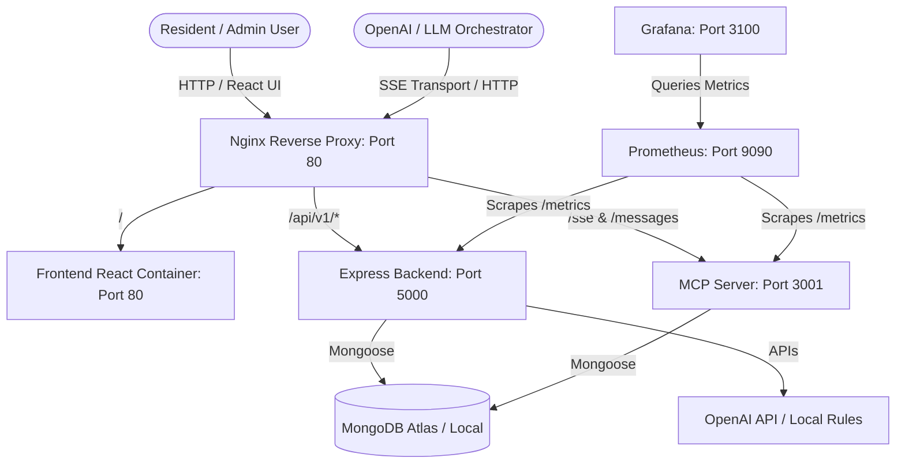

# Society Maintenance Management System (SMMS)

Welcome to the **Society Maintenance Management System (SMMS)**. This repository houses a modern housing society administration dashboard and maintenance system. It features automated administrative tasks (notice bulletins, maintenance billings, resident rosters), **AI-driven complaint triage and notice translations**, and an **agentic AI interface via Model Context Protocol (MCP)**.

With the MCP integration, AI agents can query the housing database, file complaints, check maintenance ledger states, and compile reports directly through natural language.

---

## 🛠️ Demo Accounts for Testing & Login

The database is pre-seeded with the following three roles. You can use these credentials to log in to the frontend and test the platform immediately:

| Role | Email | Password | Pre-seeded Details |
| :--- | :--- | :--- | :--- |
| **Resident Owner** | `resident@emerald.com` | `password123` | **Jane Doe** (Flat unit **A-402**, Emerald Greens). Has 1 vehicle, 1 family member, and 1 unpaid maintenance bill of **$3,200** for June 2026. |
| **Society Secretary (Admin)** | `admin@emerald.com` | `admin123` | **Arthur Pendragon** (Admin, Emerald Greens). Can manage bills, publish notices, and view admin analytics. |
| **Contracted Vendor** | `plumber@primefix.com` | `vendor123` | **Mario Plumber** (Independent Vendor). |

*Note: If you ever need to clean the database and re-seed these accounts, run the seed script:*
```bash
cd backend
node seed-db.js
```

---

## 🏗️ High-Level System Architecture

SMMS runs on a containerized, reverse-proxied microservices architecture orchestrated with Docker. Nginx serves as the single router/proxy entry point.



---

## 📁 Repository Structure

```text
Society_mcp_server/
├── backend/                       # Express API Backend (Node.js & TypeScript)
│   ├── src/
│   │   ├── config/                # Mongoose database setup
│   │   ├── controllers/           # API endpoints controllers
│   │   ├── middlewares/           # JWT, Role check, and Prom-metrics middlewares
│   │   ├── models/                # 11 Mongoose database schemas
│   │   ├── routes/                # Express routing endpoints
│   │   ├── services/              # AI services (OpenAI complaint & translation engines)
│   │   └── utils/                 # Winston logger, prometheus metrics
│   ├── seed-db.js                 # Database seeder script
│   └── package.json
├── frontend/                      # React SPA Dashboard (Vite, React 18, TailwindCSS)
│   ├── src/
│   │   ├── api/                   # Axios client with automatic silent token refresh
│   │   ├── components/            # Layout wraps, glassmorphic UI components, route guards
│   │   ├── features/              # Redux slices (auth slice, local storage gates)
│   │   ├── pages/                 # UI pages (Dashboard, Complaints, Payments, Residents, Notices)
│   │   └── App.tsx                # Client-side router layout mappings
│   └── package.json
├── mcp-server/                    # Model Context Protocol SSE Server (Clean Architecture)
│   ├── src/
│   │   ├── client/                # Simulation client
│   │   ├── domain/                # Enterprise domain logic & repository interfaces
│   │   ├── infrastructure/        # Mongoose repository implementations
│   │   ├── models/                # Schema definitions for MCP mapping
│   │   └── index.ts               # SSE transport, Express routes, and MCP tools registration
│   └── package.json
├── observability/                 # System telemetry
│   ├── prometheus/                # Prom metrics configurations & alert rules
│   └── grafana/                   # Datasource binding & dashboards config
├── docker-compose.yml             # System orchestrator mapping all containers
├── nginx.conf                     # Nginx path router configuration
└── .env                           # Environment variables and connection keys
```

---

## 🚀 Getting Started

You can run the project locally or via Docker Compose.

### Option A: Local Development Setup

To run each service individually on your host machine:

#### 1. Setup Environment
Ensure your root `.env` and `mcp-server/.env` files are configured with valid connection details. The project defaults to a cloud-hosted MongoDB Atlas URI.

#### 2. Start the Backend API
```bash
cd backend
npm install
# Seed the database with the test accounts
node seed-db.js
# Start development server
npm run dev
```
*Runs at `http://localhost:5000`*

#### 3. Start the Frontend Client
```bash
cd frontend
npm install
npm run dev
```
*Runs at `http://localhost:5173` (proxied to port 80 in Docker)*

#### 4. Start the MCP Server
```bash
cd mcp-server
npm install
npm run build
npm run dev
```
*Runs at `http://localhost:3001`*

---

### Option B: Running via Docker Compose

To boot up the entire stack (including Nginx reverse proxy, local database container, and telemetry tools) with a single command:

```bash
docker-compose up --build
```

#### Entry Point Mappings:
*   **Web Dashboard**: [http://localhost](http://localhost) (Proxied to React Frontend)
*   **Backend Server**: [http://localhost:5000](http://localhost:5000) (REST API)
*   **MCP Server (SSE Endpoint)**: [http://localhost:3001/sse](http://localhost:3001/sse)
*   **Grafana Dashboard**: [http://localhost:3100](http://localhost:3100) (default credentials: `admin` / `admin`)

---

## 🤖 Testing the MCP Server

The MCP server exposes its schema over **Server-Sent Events (SSE)**.

To test if the MCP server is working, compile the code and run the automated test suite script:

```bash
cd mcp-server
npm run build
node dist/test-sse-client.js
```

This script:
1. Spawns the MCP server.
2. Connects to `http://localhost:3001/sse` and establishes the client transport session.
3. Requests `tools/list` to fetch available tools.
4. Executes calls to `getResident` and `getPendingPayments` against the database to verify end-to-end integration.
