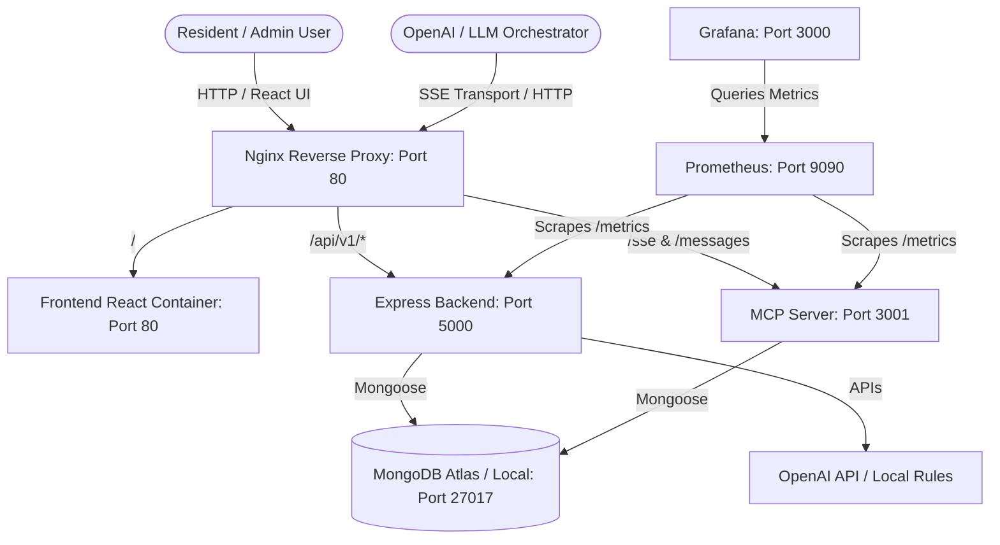
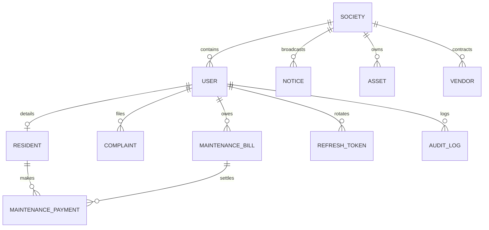
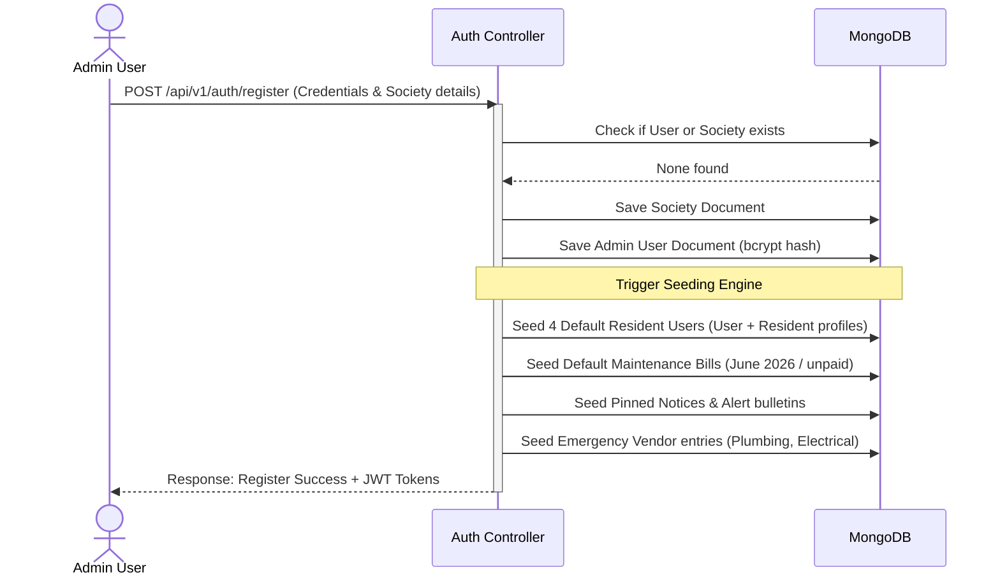

# Society Maintenance Management System (SMMS) — Level 0 Technical Guide

Welcome to the complete learning walkthrough for the **Society Maintenance Management System (SMMS)**. This document serves as a comprehensive, level-0 guide designed to teach you the system architecture, database design, backend services, frontend application, and its unique Model Context Protocol (MCP) AI integration from the ground up.

---

## 1. System Overview

The Society Maintenance Management System is a modern housing society administration and maintenance system. It automates common administrative tasks (notices, payments, resident rosters) and provides advanced features like **AI-based complaint triage**, **automatic language translation for notices**, and an **agentic AI interface via Model Context Protocol (MCP)**.

With the MCP integration, an LLM (such as GPT-4) can directly query the housing database, generate collection reports, file complaints, and trigger alert broadcasts using natural language.

---

## 2. High-Level Architecture

The project follows a containerized, multi-service architecture orchestrated via Docker Compose. The diagram below illustrates how client applications, the AI orchestrator, services, and the database connect:



### Port Mapping Summary
*   **Nginx Proxy**: `80` (Entry point for all HTTP traffic)
*   **Express Backend**: `5000` (Internal API service)
*   **MCP SSE Server**: `3001` (Internal Model Context Protocol server)
*   **Frontend Client**: `5173` (Vite dev) / `80` (Nginx-served production build)
*   **MongoDB**: `27017` (Database)
*   **Prometheus**: `9090` (Metrics collection)
*   **Grafana**: `3000` (Metrics dashboard visualization)

---

## 3. Project Structure

The repository is organized into three primary services alongside configuration for reverse-proxy routing and observability:

```text
Society_mcp_server/
├── backend/                       # Express API Backend (Node.js & TypeScript)
│   ├── src/
│   │   ├── config/                # Mongoose database setup
│   │   ├── controllers/           # API endpoints controllers
│   │   ├── middlewares/           # JWT verification, Role checks, Prom-metrics, Error handlers
│   │   ├── models/                # 11 Mongoose database schemas
│   │   ├── routes/                # Express routing blueprints
│   │   ├── services/              # AI services (OpenAI complaint & translation engines)
│   │   ├── utils/                 # Winston logger, prometheus trackers, custom app errors
│   │   └── validators/            # Zod validation schemas
│   └── package.json
├── frontend/                      # React SPA Dashboard (Vite, React 18, TailwindCSS)
│   ├── src/
│   │   ├── api/                   # Axios client with automatic silent token refresh queues
│   │   ├── components/            # Layout wraps, glassmorphic UI components, route guards
│   │   ├── features/              # Redux slices (auth slice, local storage gates)
│   │   ├── pages/                 # UI pages (Dashboard, Complaints, Payments, Residents, Notices)
│   │   ├── App.tsx                # Client-side router layout mappings
│   │   └── main.tsx               # Redux & React Query providers mounting
│   └── package.json
├── mcp-server/                    # Model Context Protocol SSE Server (Clean Architecture)
│   ├── src/
│   │   ├── client/                # OpenAI Orchestrator simulation client
│   │   ├── domain/                # Enterprise domain logic & repository interfaces
│   │   ├── infrastructure/        # Mongoose implementations of domain repositories
│   │   ├── models/                # Simplified copy of Mongoose database schemas
│   │   ├── schemas/               # Zod validation tools parameters definitions
│   │   ├── services/              # Core business use cases (GetResident, RegisterComplaint, etc.)
│   │   └── index.ts               # SSE transport, Express routes, and MCP tools registration
│   └── package.json
├── observability/                 # System telemetry
│   ├── prometheus/                # Prom metrics configurations & custom alert rules
│   └── grafana/                   # Automatic datasource binding & pre-configured dashboards
├── docker-compose.yml             # System orchestrator mapping all 7 containers
├── nginx.conf                     # Nginx path router mapping APIs, SSE, and static React files
└── .env                           # Environment secrets database connections
```

---

## 4. Database Schema & Models

The system runs on **MongoDB** using **Mongoose** as an ORM. There are 11 distinct models modeling a housing society's operations. The relationship structure is represented below:



### Models Overview
1.  **[User.ts](file:///d:/projects/Society_mcp_server/backend/src/models/User.ts)**: Stores account details (email, hashed password, and role). Supports 6 roles: `SuperAdmin`, `SocietyAdmin`, `ResidentOwner`, `ResidentTenant`, `Staff`, and `Vendor`.
2.  **[Society.ts](file:///d:/projects/Society_mcp_server/backend/src/models/Society.ts)**: Represents a physical housing society (name, address, billing cycles, maintenance rates).
3.  **[Resident.ts](file:///d:/projects/Society_mcp_server/backend/src/models/Resident.ts)**: Connects a `User` to a physical flat (block, flat number, vehicles list, family members, emergency contacts).
4.  **[Complaint.ts](file:///d:/projects/Society_mcp_server/backend/src/models/Complaint.ts)**: Houses resident support tickets. Contains AI evaluation fields: `detectedCategory`, `confidenceScore`, `estimatedPriority`, and `sentimentScore`.
5.  **[MaintenanceBill.ts](file:///d:/projects/Society_mcp_server/backend/src/models/MaintenanceBill.ts)**: Invoices for a billing period. Statuses: `Unpaid`, `Paid`, `Partially-Paid`, `Overdue`.
6.  **[MaintenancePayment.ts](file:///d:/projects/Society_mcp_server/backend/src/models/MaintenancePayment.ts)**: Records billing transactions. Supports payment methods: `Card`, `UPI`, `NetBanking`, `Cash`, `Cheque`.
7.  **[Notice.ts](file:///d:/projects/Society_mcp_server/backend/src/models/Notice.ts)**: Announcements targeted at specific audiences (e.g., `Owners` only). Stores multi-language translations (`en`, `hi`, `mr`).
8.  **[Vendor.ts](file:///d:/projects/Society_mcp_server/backend/src/models/Vendor.ts)**: Contracts for plumbers, electricians, security teams. Automatically averages ratings.
9.  **[Asset.ts](file:///d:/projects/Society_mcp_server/backend/src/models/Asset.ts)**: Society-owned equipment (elevators, water pumps, generators) tracked for failure risks.
10. **[AuditLog.ts](file:///d:/projects/Society_mcp_server/backend/src/models/AuditLog.ts)**: Logs user mutations for security reviews.
11. **[RefreshToken.ts](file:///d:/projects/Society_mcp_server/backend/src/models/RefreshToken.ts)**: Manages secure token rotation to prevent session hijacking.

---

## 5. Backend Deep-Dive

The backend app is built with **Node.js, Express, and TypeScript**.

### Core Backend Components:
*   **Express Setup ([app.ts](file:///d:/projects/Society_mcp_server/backend/src/app.ts))**: Initializes middlewares, registers REST routes under `/api/v1/`, mounts the Prometheus `/metrics` scraping endpoint, and configures the global error handler.
*   **Database Config ([database.ts](file:///d:/projects/Society_mcp_server/backend/src/config/database.ts))**: Connects to the MongoDB Atlas URI or local instance using Mongoose.
*   **AI Service ([ai.service.ts](file:///d:/projects/Society_mcp_server/backend/src/services/ai.service.ts))**: 
    1.  `analyzeComplaint`: Uses keyword rules with an OpenAI fallback to categorize tickets, evaluate sentiment, and estimate priority.
    2.  `translateNotice`: Automatically translates notices into Hindi and Marathi.
    3.  `scoreAssetFailureRisk`: Uses operational data (age, hours run, days since last service) to forecast equipment failures.

```typescript
// AI Service Example - Analysis Fallback Logic
export async function analyzeComplaint(title: string, description: string) {
  const content = `${title}\n${description}`.toLowerCase();
  
  // 1. Check local keyword definitions first (Fallback)
  let category = 'Other';
  let priority = 'Medium';
  
  if (content.includes('water') || content.includes('leak') || content.includes('pipe')) {
    category = 'Plumbing';
    priority = content.includes('flood') ? 'High' : 'Medium';
  } else if (content.includes('wire') || content.includes('power') || content.includes('shock')) {
    category = 'Electrical';
    priority = content.includes('spark') ? 'High' : 'Medium';
  }
  
  // 2. If OpenAI Key is available, augment with GPT analysis
  if (process.env.OPENAI_API_KEY) {
    try {
      const completion = await openai.chat.completions.create({
        model: "gpt-4o",
        messages: [{ role: "user", content: `Analyze this complaint: ${content}...` }]
      });
      // Parse LLM categorization response...
    } catch (err) {
      logger.warn("OpenAI API call failed, falling back to local rule assessment.");
    }
  }
  return { category, estimatedPriority: priority, confidenceScore: 0.85 };
}
```

*   **Middlewares**:
    *   **[auth.middleware.ts](file:///d:/projects/Society_mcp_server/backend/src/middlewares/auth.middleware.ts)**: Verifies incoming `Authorization: Bearer <JWT>` headers. The `requireRole` helper enforces RBAC gates on mutations.
    *   **[error.middleware.ts](file:///d:/projects/Society_mcp_server/backend/src/middlewares/error.middleware.ts)**: Catches exceptions (Mongoose cast errors, validation issues, JWT expiries) and returns structured JSON errors.
    *   **[metrics.middleware.ts](file:///d:/projects/Society_mcp_server/backend/src/middlewares/metrics.middleware.ts)**: Records the duration and response codes of all HTTP requests.

---

## 6. Frontend Deep-Dive

The frontend is a Single Page Application (SPA) built with **React 18, Redux Toolkit, React Query, and TailwindCSS**. It features a modern dark-mode aesthetic with glassmorphic cards and transitions.

### Key Features:
*   **State Management ([authSlice.ts](file:///d:/projects/Society_mcp_server/frontend/src/features/auth/authSlice.ts))**: Stores active JWT access tokens, logged-in user profile attributes, and manages token persistence via `localStorage`.
*   **Axios Client & Token Refresh ([axiosClient.ts](file:///d:/projects/Society_mcp_server/frontend/src/api/axiosClient.ts))**: 
    Uses Axios interceptors to handle silent token renewals. If an API request fails with a `401 Unauthorized` response, the interceptor pauses outgoing requests, requests a new access token using the HTTP-only refresh cookie, and replays the original requests without interrupting the user.

```typescript
// axiosClient.ts - Request Retry Queue during Token Refresh
axiosClient.interceptors.response.use(
  (response) => response,
  async (error) => {
    const originalRequest = error.config;
    if (error.response?.status === 401 && !originalRequest._retry) {
      if (isRefreshing) {
        // Queue request if token refresh is already in progress
        return new Promise((resolve, reject) => {
          failedQueue.push({ resolve, reject });
        })
          .then((token) => {
            originalRequest.headers['Authorization'] = 'Bearer ' + token;
            return axiosClient(originalRequest);
          })
          .catch((err) => Promise.reject(err));
      }
      
      originalRequest._retry = true;
      isRefreshing = true;
      
      try {
        const { data } = await axios.post('/api/v1/auth/refresh');
        const { accessToken } = data;
        
        // Dispatch new credentials to Redux store...
        processQueue(null, accessToken);
        originalRequest.headers['Authorization'] = 'Bearer ' + accessToken;
        return axiosClient(originalRequest);
      } catch (refreshError) {
        processQueue(refreshError, null);
        // Redirect user to login...
        return Promise.reject(refreshError);
      } finally {
        isRefreshing = false;
      }
    }
    return Promise.reject(error);
  }
);
```

*   **Pages Layout**:
    *   **Dashboard ([Dashboard.tsx](file:///d:/projects/Society_mcp_server/frontend/src/pages/Dashboard.tsx))**: Visualizes key metrics like total collections, active complaints, notices bulletin, and recent payments.
    *   **Complaints ([Complaints.tsx](file:///d:/projects/Society_mcp_server/frontend/src/pages/Complaints.tsx))**: Supports filing, viewing status, and assigning staff to complaints.
    *   **Payments ([Payments.tsx](file:///d:/projects/Society_mcp_server/frontend/src/pages/Payments.tsx))**: Displays outstanding bills and allows residents to make test payments.

---

## 7. Model Context Protocol (MCP) Server

The **Model Context Protocol (MCP)** is an open standard designed to connect LLM assistants with data sources and tools. 

The MCP Server uses a **Clean Architecture** structure:

```text
mcp-server/src/
├── domain/                  # Interfaces (Contracts) defining repository behavior
├── infrastructure/          # Mongoose database queries implementing those interfaces
├── services/                # Core business use cases triggered by MCP Tool commands
└── index.ts                 # Express endpoints establishing the SSE connection
```

### Express & SSE Connection:
Instead of standard HTTP REST queries, the MCP server establishes a persistent Server-Sent Events (SSE) stream via `GET /sse`. 
1. The client connects to `GET /sse` and receives a persistent stream.
2. The server fires an `endpoint` event containing a unique routing URL (e.g., `/messages?sessionId=xyz`).
3. The client sends JSON-RPC requests (like tool discovery or tool execution commands) via `POST /messages?sessionId=xyz`.
4. The server returns JSON-RPC responses through the open SSE channel.

### MCP Features List:

| Type | Name | Purpose | Input / Outputs |
| :--- | :--- | :--- | :--- |
| **Tool** | `getResident` | Find resident details by unit number | In: `block`, `flatNumber` |
| **Tool** | `getPendingPayments` | List outstanding maintenance bills | In: `status`, `billingPeriod` |
| **Tool** | `registerComplaint` | Register a complaint ticket with auto-triage | In: `block`, `flatNumber`, `title`, `description` |
| **Tool** | `createNotice` | Create and pin a notice bulletin | In: `title`, `content`, `category`, `targetAudience` |
| **Tool** | `generateReport` | Get Collections, Ticket, or Occupancy stats | In: `reportType`, `billingPeriod` |
| **Tool** | `sendReminder` | Send payment alert reminders | In: `residentId`, `billId`, `customMessage` |
| **Resource** | `society://residents/list` | Returns a list of all residents | Formatted JSON Array |
| **Resource** | `society://notices/bulletin` | Returns active notices | Markdown bulletin list |
| **Resource** | `society://system/health` | Checks database connection health | Healthy / Degraded JSON status |
| **Prompt** | `triage-complaints` | Suggests assignments for open complaints | LLM System Prompt instructions |
| **Prompt** | `reconcile-ledger` | Verifies outstanding ledger details | LLM Ledger Reconciliation instruction |

*   **OpenAI Orchestrator ([openai-orchestrator.ts](file:///d:/projects/Society_mcp_server/mcp-server/src/client/openai-orchestrator.ts))**:
    A script demonstrating how an LLM agent uses the MCP server. It connects to the SSE channel, discovers the available tools, translates them into the OpenAI tool schema, runs a reasoning loop, and calls the appropriate tools to answer queries like *"Who has not paid maintenance this month?"*.
    
    If `OPENAI_API_KEY` is not configured, the script runs in **Mock Simulation Mode**. In this mode, it simulates the LLM's response internally but still executes real database queries over the SSE connection to verify the system works end-to-end.

---

## 8. End-to-End Key Data Flows

### A. Resident Registration & Database Auto-Seeding
When a new SuperAdmin or SocietyAdmin registers, the backend seeds the database with initial sample data to make the system immediately usable:



### B. LLM Agentic Query & Tool Call Execution (MCP Tool Flow)
This flow shows how the OpenAI orchestrator processes the question *"Who has not paid maintenance this month?"* using the MCP server:

```mermaid
sequenceDiagram
    actor Client as Orchestrator Client
    participant SSE as MCP SSE Server
    participant DB as MongoDB
    
    Client->>SSE: Connect to GET /sse (Stream Open)
    SSE-->>Client: event: endpoint (data: "/messages?sessionId=session_1")
    
    Client->>SSE: POST /messages?sessionId=session_1 (tools/list)
    SSE-->>Client: Return available tool schema arrays (getPendingPayments, etc.)
    
    Note over Client: Translate MCP schemas to OpenAI format
    Note over Client: Send query to OpenAI (Or run Mock Simulation)
    
    Client->>SSE: POST /messages?sessionId=session_1 (tools/call: getPendingPayments { status: "Unpaid" })
    activate SSE
    SSE->>DB: Find bills where status == "Unpaid"
    DB-->>SSE: Returns raw bills list
    SSE-->>Client: JSON RPC result (Outstanding bills + resident details)
    deactivate SSE
    
    Note over Client: Pass data back to OpenAI for final analysis
    Client-->>actor User: Synthesized Response: "The following residents have not paid: block A flat 102..."
```

---

## 9. Role-Based Access Control (RBAC) Matrix

The system enforces role-based access control. The table below outlines which operations each user role can perform:

| Feature / Action | SuperAdmin | SocietyAdmin | ResidentOwner | ResidentTenant | Staff | Vendor |
| :--- | :---: | :---: | :---: | :---: | :---: | :---: |
| **Manage Societies** | Yes | No | No | No | No | No |
| **Register Admins** | Yes | No | No | No | No | No |
| **Manage Residents** | Yes | Yes | No | No | No | No |
| **Create Notices** | Yes | Yes | No | No | Yes | No |
| **Create Bills** | Yes | Yes | No | No | No | No |
| **Record Payments** | Yes | Yes | Yes (Own) | Yes (Own) | No | No |
| **File Complaints** | Yes | Yes | Yes (Own) | Yes (Own) | No | No |
| **Assign Technicians** | Yes | Yes | No | No | Yes | No |
| **Resolve Tickets** | Yes | Yes | No | No | Yes | Yes |
| **Manage Vendors** | Yes | Yes | No | No | No | No |
| **Rate Vendors** | Yes | Yes | Yes | Yes | No | No |

---

## 10. Verification & Local Operations

### Environment Configuration:
Before running the project locally or in production, configure the environment variables in the root `.env` file:

```bash
# General
NODE_ENV=production
PORT=5000                   # Express backend API port
MCP_PORT=3001               # MCP SSE server port

# Security
JWT_SECRET=your_jwt_secret_key_here
ADMIN_SIGNUP_SECRET=secret_to_register_admins

# Database
MONGO_URI=your_mongodb_connection_uri_here
MONGO_DB_NAME=society_maintenance_db

# OpenAI Integration
OPENAI_API_KEY=your_openai_key_here
```

### Running Locally with Docker Compose:
To start the entire stack (all 7 services including databases, backend, frontend, MCP server, and observability dashboard), run the following command in the root directory:

```powershell
docker-compose up -d --build
```

### Running the Orchestrator Tests:
To test the MCP server and LLM integration, run the orchestrator client:

```powershell
# 1. Start the MCP server if not running:
cd mcp-server
npm run dev

# 2. In another terminal, run the orchestrator client:
npm run test-client
```

This will run the agent loop to test tool discovery and execution against your database.

---

## 11. Summary of System Integration

SMMS combines multiple development practices into a single system:
*   **Database**: Uses Mongoose for relationships, compound indexes, and schemas.
*   **Backend**: Exposes standard REST APIs with Zod validations and JWT authentication.
*   **Frontend**: Built with React, featuring silent token refresh handling and a modern glassmorphic design.
*   **AI**: Combines local rule-based analysis with optional OpenAI models, exposed to LLM agents using the Model Context Protocol (MCP) standard.
*   **Observability**: Monitored via Prometheus metrics scraping and Grafana dashboards.
